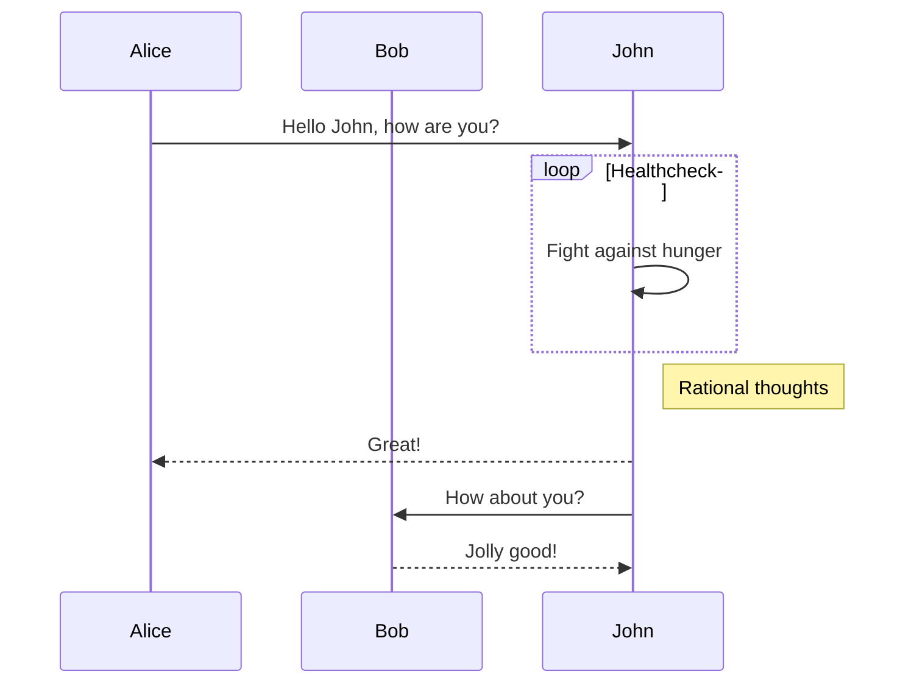

# Viewing Markdown in VS Code
[Markdown Cheatsheet](https://devhints.io/markdown)
[Markdown Rules](https://github.com/DavidAnson/markdownlint/blob/v0.15.0/doc/Rules.md)
[Markdown Cheat Sheet](https://www.makeuseof.com/tag/printable-markdown-cheat-sheet/)
[MarkDown in Visual Studio Code](https://code.visualstudio.com/docs/languages/markdown)

> Right click the tab of the .md file and select Open Preview.
> Alternatively, you can bring up a side preview with Ctrl-K V

## Markdown Guide

Create document links with\:

\- \[Display Name]\(#link)

- [Headers](#headers)
- [Formatting](#formatting)
- [Separators](#separators)
- [Lists](#lists)
- [Indenting](#indenting)
- [Code Blocks](#code-blocks)
- [Tables](#tables)
- [Links](#links)
- [Images](#images)
- [Emoji](#emoji)
- [Mermaid Support](#mermaid-support)

## Headers

```md
# Single hashtag + space = HTML h1 tag
## Double hashtag + space = HTML h2 tag
### Triple hashtag + space = HTML h3 tag
#### Quadruple hashtag + space = HTML h4 tag
```

[Home](#markdown-guide)

## Formatting

> Single Asterisk = *Italicized*
> Double Asterisk = **bold**
> Triple Asterisk = ***Bold and Italicized***

[Home](#markdown-guide)

## Separators

  Triple dash = line separator

  ---

[Home](#markdown-guide)

## Lists

Dash+Space = unordered list

> - List Item
> - List Item

Number+period or right parenthesis = numbered list

> 1. List Item
> 2. List Item

Check Boxes
- [x] List Item
- [ ] List Item

[Home](#markdown-guide)

## Indenting

Greater-Than+space to indent

> Indented

[Home](#markdown-guide)

## Code Blocks

Wrap code with Back-ticks \`

`code here`

Wrap code blocks with Triple back-quotes followed by the language type IE: \```html

> ```vb
> print 'hello'
> print 'world'
> ```

Javascript Highlighting Example

> ```javascript
> var num = 0;
> var num2 = 0;
> ```

HTML Highlighting Example

> ```html
> <div>
>   <p>This is an html example</p>
> </div>
> ```

[Home](#markdown-guide)

## Tables

Tables are useful for displaying rows and columns of data.  Column headers can be defined in between pipes (|).  Headers are separated from table content with a row of dashes (-) (still separated by pipes), and there must be at least 3 dashes between each header.  The row data follows beneath (still separated by pipes).

> | Header 1                | Header 2              |
> | ----------------------- | --------------------- |
> |Loooooooooooooong item 1 | looooooooooong item 2 |

You can also left, center, and right align the text in a column by using colons in the line between the headers and rows.  No colon means the default **left alignment**.  Colons on each side signifies **center alignment**.  And a trailing colon means **right alignment**. ( IE :----: or ----: )

> | Header          | Header 1        | Header 2            |
> | --------------- | :-------------: | -------------------:|
> | Aligned Left    | Aligned Center  | Aligned Right       |

[Home](#markdown-guide)

## Links

Create a link by surrounding it with angle bracket

> <http://user.xmission.com/~jeff_trusty/#autoopen>

Create a link with text by surrounding text with brackets, [], and link immediately following with parenthesis ()

Example

> [My links at X-Mission](http://user.xmission.com/~jeff_trusty/#autoopen)

[Home](#markdown-guide)

## Images

Defining an image is similar to defining a link, except you prefix it with '!'

> 

Just like links, you can define images by reference in the same format.

Define the reference

> `[enterprise-d]: https://cnet1.cbsistatic.com/img/8-Bu7l-XLO7lHxKKmzcOgmkoVXY=/936x527/2013/05/15/e8bbdf46-f07b-11e2-8c7c-d4ae52e62bcc/TNG_EntD_005.jpg`

[enterprise-d]: https://cnet1.cbsistatic.com/img/8-Bu7l-XLO7lHxKKmzcOgmkoVXY=/936x527/2013/05/15/e8bbdf46-f07b-11e2-8c7c-d4ae52e62bcc/TNG_EntD_005.jpg

Use the reference
> `![Optum Logo][enterprise-d]`
> ![Optum Logo][enterprise-d]

[Home](#markdown-guide)

## Emoji

Markdown Emoji extension:

Link to Emoji documentation:  <https://www.webfx.com/tools/emoji-cheat-sheet/>

:sleeping: :wink:

[Home](#markdown-guide)

## Mermaid Support

<https://shd101wyy.github.io/markdown-preview-enhanced/#/>

Markdown Preview Enhanced extension:

Flow charting per <http://flowchart.js.org/>

```flow
st=>start: Start:>https://www.google.com[blank]
e=>end:>https://www.google.com
op1=>operation: My Operation
sub1=>subroutine: My Subroutine
cond=>condition: Yes or No?:>https://www.google.com
io=>inputoutput: catch something...
para=>parallel: parallel tasks

st->op1->cond
cond(yes)->io->e
cond(no)->para
para(path1, bottom)->sub1(right)->op1
para(path2, top)->op1
```

Mermaid diagraming: <https://mermaidjs.github.io/>




[Home](#markdown-guide)
